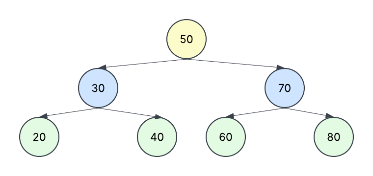

Amarillo : Raiz 
Azul : Padres
Verde : Hojas

¿Qué propiedad debe cumplir todo Árbol Binario de Búsqueda? 
- Que los valores del subarbol izquirdo deben de ser menores que el padre y los del subarbol derecho deben de ser mayores que el padre

¿Cuál es la raíz del árbol construido?  
 - la raiz es 50

¿Qué nodos son hojas? 
 - Las hojas son 80, 60, 40 y 20

¿Qué valores pertenecen al subárbol izquierdo de 50 y cuáles al derecho?  
  - Izquierdo : 70, 80 , 60
  - Derecho: 30, 40, 20

¿Qué secuencia esperas obtener con el recorrido inorden? 
 - 20, 30, 40, 50, 60, 70, 80

## Busqueda

¿Por qué no es necesario recorrer todos los nodos del árbol para buscar una clave? 
 - No es necesario reccorrer todos los nodos ya que podemos solamente recorrer el mismo camino que ese nodo debio de seguir para anadirse al arbol para encontrarlo

Si se busca 40, ¿qué nodos se visitan y en qué orden? 
 - Comenzaria en la raiz luego iria al nodo 30 que se encuentra en la derecha y por ultimo iria al nodo 40 de la izquierda 

Si se busca 90, ¿qué condición permitirá concluir que no existe? 
 - Encontraria null en vez de el numero 

¿Qué valor booleano debe regresar el caso base cuando el nodo actual es null? 
 - Regresaria false

¿Qué ocurriría si el árbol no respetara la regla menor-izquierda y mayor-derecha? 
 - Si no se respetara esta regla no podríamos encontrar con facilidad la ubicación de los elementos del arbol

## Eliminacion

¿Por qué la eliminación requiere más casos que la búsqueda? 
 - Requiere mas casos de búsqueda porque tienes que encontrar el nodo y checar si ese nodo tiene hijos

¿Qué debe ocurrir si la clave que se desea eliminar no existe? 
 - Si no existe simplemente no se elimina nada

¿Por qué eliminar un nodo hoja es el caso más sencillo? 
 - Es el caso mas sencillo porque solo se tiene que encontrar la posicion del nodo, no hay que remplazar el nodo padre por uno de sus hijos

Si un nodo tiene solamente un hijo, ¿por qué puede devolverse directamente la referencia a ese hijo? 
 - Porque despues de eliminar el nodo padre, el nodo hijo debe de tomar su posicion

¿Por qué el menor valor del subárbol derecho es un candidato adecuado para sustituir a un nodo con dos hijos? 
 - Porque ese numero es mas grande que el numero del subárbol de la izquierda y como consecuencia de eso solo hay que sustituir el padre original por el valor de la derecha y como el valor de la izquirda sigue siendo mas pequeño que el nuevo padre no cambia de posición

Después de copiar el valor sustituto, ¿por qué todavía es necesario eliminar ese valor de su ubicación original? 
 - Para evitar valores duplicados

¿Qué riesgo existiría si se eliminara un nodo con dos hijos sin reconectar correctamente sus subárboles? 
 - Se perderia informacion ya que habrian nodos que no estan relacionados con ningun otro dato

¿Por qué eliminar la raíz puede modificar la variable raiz del árbol? 
 - Porque la raiz es un nodo como las demas ramas del arbol, por lo que si la eliminamos el nodo de la raiz se va a sustituir por el nodo de la derecha

¿Qué propiedad debe seguir cumpliendo el árbol después de cualquier eliminación? 
 - Que los valore a la izquierda de un padre deben de ser menores y los valores a la derecha deben de ser mayores que el padre

## Metodo Auxiliar

¿Hacia qué dirección debes desplazarte para encontrar el mínimo?  
 - Hacia la izquierda

¿Qué condición indica que ya encontraste el nodo mínimo?  
 - Si el nodo no tiene ningun hijo a la izquirda

¿Cuál es el mínimo del subárbol cuya raíz es 70 en el árbol inicial?  
 -s

## Reflexiones finales

¿Cómo ayuda el recorrido inorden a comprobar que el ABB conserva su estructura? 
 - Te permite ver los nodos y como estan conectados entre ellos, debido a esto es posible determinar si hubo un cambio grande en la estructura del arbol despues de añadir o eliminar un nodo

Explica con tus palabras el caso de eliminación que consideraste más difícil. 
- Es caso que considero que es mas dificil es el de elminar un padre que tiene dos hijos porque hay que remplazar el padre por uno de los hijos y ver que el nuevo padre tenga los mismos hijos que el padre original

¿Qué papel cumple la recursividad en los métodos de búsqueda y eliminación? 
- La recursividad te permite recorer el arbol

¿Qué aprendiste sobre el cambio de referencias entre nodos al eliminar elementos? 
- s

Si tuvieras que explicar a un compañero la diferencia entre buscar y eliminar en un ABB, ¿qué le dirías? 

