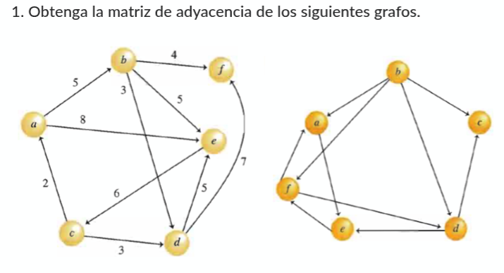
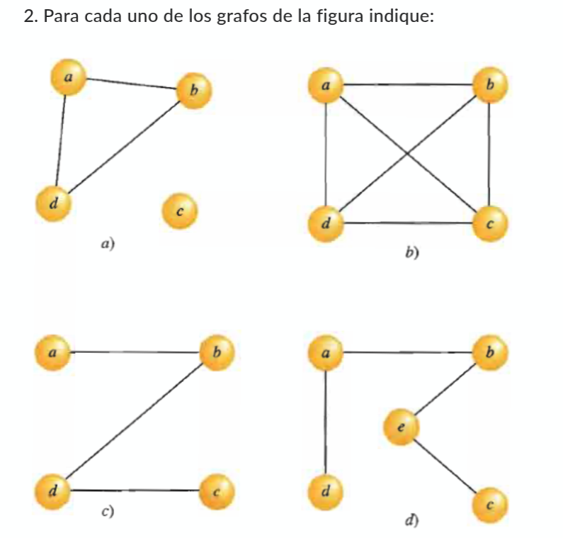

1) Matriz 1

$$
\begin{bmatrix}
   & a & b & c & d & e & f\\
 a & 0 & 1 & 0 & 0 & 1 & 0 \\
 b & 0 & 0 & 0 & 1 & 1 & 1 \\
 c & 1 & 0 & 0 & 1 & 1 & 0 \\
 d & 0 & 0 & 0 & 0 & 1 & 1\\
 e & 0 & 0 & 1 & 0 & 0 & 0\\
 f & 0 & 0 & 0 & 0 & 0 & 0
\end{bmatrix}
$$

2) Matriz 2

$$
\begin{bmatrix}
  & a & b & c & d & e & f\\
a & 0 & 0 & 0 & 0 & 1 & 0 \\
b & 1 & 0 & 1 & 1 & 0 & 1 \\
c & 0 & 0 & 0 & 0 & 0 & 0 \\
d & 0 & 0 & 1 & 0 & 1 & 0\\
e & 0 & 0 & 0 & 0 & 0 & 1\\
f & 1 & 0 & 0 & 1 & 0 & 0
\end{bmatrix}
$$

II.-

 * Aquellas que son gráficas conexas.
 * Aquellas que son gráficas cíclicas.
 * Aquellas que son gráficas completas.
 * Todos los pares de vértices adyacentes.
 * Un camino entre los vértices a y c, si es posible
 * Un camino cerrado entre cualquier par de vértices, si es posible.
 * Un camino simple entre cualquier par de vértices, si es posible.
 * El grado de cada vértice

a)

 * a,b,d estan conexas
 * a,b,d son ciclicas
 * El par ad y bd son adyecentes, el par ad y ab son adyacentes y el par ab y bd son adyacentes
 * No es posible el camino entre a y c
 * Hay un camino cerrado puedes ir de a - a (a -> b -> d -> a)
 * Hay un camino simple de a - d (a -> d)
 * 