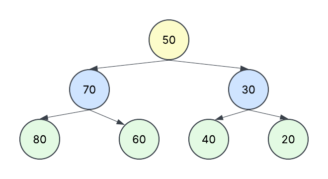

Amarillo : Raiz 
Azul : Padres
Verde : Hojas

¿Qué propiedad debe cumplir todo Árbol Binario de Búsqueda? 

¿Cuál es la raíz del árbol construido?  
 - la raiz es 50

¿Qué nodos son hojas? 
 - Las hojas son 80, 60, 40 y 20

¿Qué valores pertenecen al subárbol izquierdo de 50 y cuáles al derecho?  
  - Izquierdo : 70, 80 , 60
  - Derecho: 30, 40, 20

¿Qué secuencia esperas obtener con el recorrido inorden? 
 - 80, 70, 60, 50, 40, 30, 20

